# Dokumen Produk — Platform Booking Penginapan

> **Versi:** 2.0  
> **Tanggal:** 11 April 2026  
> **Status:** Konsep Produk & Perencanaan  
> **Pembaruan:** Integrasi sistem wallet, withdrawal, order history, gap analysis, dan penyempurnaan produk

---

## Daftar Isi

1. [Ringkasan Eksekutif](#1-ringkasan-eksekutif)
2. [Visi & Misi Produk](#2-visi--misi-produk)
3. [Model Bisnis](#3-model-bisnis)
4. [Target Pasar & Peluang](#4-target-pasar--peluang)
5. [Riset Pasar & Analisis Kompetitor](#5-riset-pasar--analisis-kompetitor)
6. [Arsitektur Platform](#6-arsitektur-platform)
7. [Fitur & Fungsionalitas](#7-fitur--fungsionalitas)
8. [Sistem Keuangan & Settlement](#8-sistem-keuangan--settlement)
9. [Alur Pengguna (User Flow)](#9-alur-pengguna-user-flow)
10. [Siklus Status Booking](#10-siklus-status-booking)
11. [Strategi Harga & Pembayaran](#11-strategi-harga--pembayaran)
12. [Desain & Pengalaman Pengguna (UX)](#12-desain--pengalaman-pengguna-ux)
13. [Rekomendasi Technology Stack](#13-rekomendasi-technology-stack)
14. [Perencanaan MVP](#14-perencanaan-mvp)
15. [Estimasi Timeline & Budget](#15-estimasi-timeline--budget)
16. [Catatan & Keputusan Tertunda](#16-catatan--keputusan-tertunda)

---

## 1. Ringkasan Eksekutif

Platform ini adalah **marketplace penginapan berbasis web** dengan model hybrid, menggabungkan konsep Traveloka, Airbnb, dan RedDoorz. Platform melayani **turis lokal dan mancanegara** dengan pendekatan B2C penuh.

**Keunikan utama (Value Proposition):**

- **Hybrid vendor model** — mitra eksternal dapat mendaftarkan unit mereka, dan platform juga dapat menjual unit yang diakuisisi dan di-maintenance sendiri.
- **Informasi Muslim-friendly** — bukan sebagai batasan, melainkan sebagai **nilai tambah**. Menyediakan informasi tempat ibadah, makanan halal, dan fasilitas ramah Muslim di sekitar penginapan.
- **Hidden Gem** — kurasi penginapan unik yang di-maintenance langsung oleh platform, dengan informasi lebih kaya dibanding unit reguler.
- **Multi-bahasa** — mendukung Bahasa Indonesia, English, dan Arabic untuk menjangkau pasar global.
- **Sistem keuangan transparan** — wallet mitra dengan riwayat transaksi lengkap dan proses withdrawal yang jelas.

**Filosofi utama:** Platform dibuat untuk **memangkas proses**, bukan menambah effort — memudahkan pelancong maupun pebisnis penginapan.

---

## 2. Visi & Misi Produk

### Visi

Menjadi platform booking penginapan terpercaya yang menghubungkan pelancong global dengan akomodasi berkualitas, dengan keunggulan informasi ramah Muslim dan kurasi hidden gem yang tidak dimiliki kompetitor.

### Misi

1. Menyederhanakan proses pencarian dan pemesanan penginapan bagi turis lokal dan internasional.
2. Memberdayakan mitra penginapan dengan tools yang efisien untuk mengelola unit mereka.
3. Menyediakan informasi tambahan yang bernilai (Muslim-friendly, hidden gem) tanpa membatasi segmen pasar.
4. Membangun ekosistem yang menguntungkan bagi semua pihak — pelanggan, mitra, dan platform.
5. Menyediakan sistem keuangan yang transparan dan terpercaya bagi mitra.

---

## 3. Model Bisnis

### 3.1 Tipe Platform

| Aspek | Keputusan |
|---|---|
| **B2B / B2C** | Full B2C. Jika ada kebutuhan B2B, tetap mengikuti flow B2C. |
| **Vendor Model** | Hybrid — mitra eksternal + unit milik platform sendiri. |
| **Revenue Model** | Markup harga dari harga dasar mitra (detail TBD). |

### 3.2 Jenis Mitra (Vendor)

Platform memiliki **dua jenis mitra** dengan pembedaan akses:

| Jenis Mitra | Deskripsi | Tingkat Akses |
|---|---|---|
| **Mitra Mandiri** | Pemilik penginapan yang bergabung secara independen. Mengelola unit mereka sendiri. | Akses standar mitra |
| **Mitra Akuisisi** | Penginapan yang diakuisisi oleh platform untuk full maintenance (upgrade unit, perawatan, dll). | Akses lebih terbatas — operasional dikelola platform |

### 3.3 Proses Approval Mitra

- Proses approval bersifat **manual** dan dilakukan **di luar platform** (proses teknis/bisnis).
- Platform hanya menerima input hasil akhir: **approved** atau **rejected**.
- Hal ini berlaku untuk:
  - Pendaftaran mitra baru
  - Perubahan harga sewa unit (wajib approval dari platform sebelum ditampilkan)

### 3.4 Strategi Markup Harga

Harga yang ditampilkan ke customer adalah **harga setelah markup** dari harga dasar yang ditetapkan mitra.

**Rekomendasi model markup:**

| Model | Cara Kerja | Kelebihan | Kekurangan |
|---|---|---|---|
| **Persentase Komisi (Direkomendasikan)** | Platform mengambil 15–20% dari harga dasar mitra | Transparan, mudah dihitung, scalable | Mitra dengan harga tinggi membayar lebih |
| **Fixed Markup** | Tambahan nominal tetap per booking | Sederhana | Tidak adil untuk unit murah vs mahal |
| **Hybrid** | Komisi dasar + markup variabel | Fleksibel | Kompleks untuk dikelola |

**Rekomendasi:** Gunakan model **persentase komisi 15–20%** karena:
- Lebih umum di industri (Airbnb ~14%, Booking.com ~15–25%, Traveloka ~15–20%).
- Transparan dan mudah dipahami oleh mitra.
- Dapat disesuaikan per kategori (hidden gem bisa markup lebih tinggi karena value lebih besar).
- Accounting dan rekonsiliasi lebih bersih.

> **Catatan:** Detail markup masih TBD dan perlu keputusan bisnis lebih lanjut.

### 3.5 Alur Keuangan (Revenue Flow)

Berikut adalah alur uang dari customer hingga mitra:

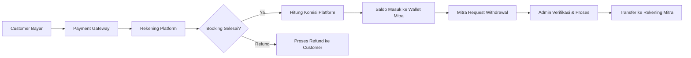

**Penjelasan alur:**
1. Customer membayar melalui payment gateway.
2. Dana masuk ke rekening platform (holding account).
3. Setelah booking selesai (check-out), bagian mitra (harga dasar) masuk ke **wallet mitra** di platform.
4. Mitra dapat mengajukan withdrawal kapan saja dari saldo wallet.
5. Proses withdrawal dilakukan **manual oleh admin internal**.
6. Dana ditransfer ke rekening bank mitra yang sudah terdaftar.

---

## 4. Target Pasar & Peluang

### 4.1 Target Pengguna

| Segmen | Deskripsi |
|---|---|
| **Turis Lokal Indonesia** | Pelancong domestik yang mencari penginapan berkualitas |
| **Turis Mancanegara** | Wisatawan internasional, termasuk dari Timur Tengah dan Asia Tenggara |
| **Wisatawan Muslim** | Segmen bernilai tinggi yang mencari informasi Muslim-friendly |
| **Pebisnis Penginapan** | Pemilik hotel, villa, homestay yang ingin memasarkan unit mereka |

### 4.2 Peluang Pasar

**Pasar Online Travel di Indonesia:**
- Indonesia adalah salah satu pasar travel digital terbesar di Asia Tenggara.
- Penetrasi internet yang tinggi dan adopsi e-commerce yang masif menjadi fondasi kuat.
- Sektor penginapan terus bertumbuh seiring pemulihan pasca-pandemi dan fokus pemerintah pada pariwisata.

**Pasar Wisata Muslim Global:**
- Menurut data CrescentRating/Global Muslim Travel Index, belanja wisata Muslim berkontribusi **lebih dari US$156 miliar** terhadap GDP global (2016) dan diproyeksikan mencapai **US$225 miliar pada 2028**.
- Wisata Muslim menempati **posisi ke-3 terbesar** dalam belanja perjalanan global, menyumbang ~11% dari total pengeluaran wisata dunia.
- Indonesia sebagai negara Muslim terbesar dunia memiliki posisi strategis.

**Tren Pasar yang Mendukung:**
- Meningkatnya kebutuhan informasi Muslim-friendly secara global — namun belum ada platform mainstream yang mengintegrasikan ini secara natural.
- Tren "hidden gem" dan penginapan unik terus meningkat (terbukti dari keberhasilan model Airbnb).
- Pendekatan platform ini — menyediakan info Muslim-friendly **sebagai nilai tambah, bukan batasan** — adalah sweet spot yang belum banyak digarap kompetitor.

### 4.3 Competitive Gap (Celah yang Bisa Dimanfaatkan)

| Kompetitor | Kelemahan yang Bisa Dieksploitasi |
|---|---|
| Traveloka | Tidak ada informasi Muslim-friendly yang terintegrasi. Tidak ada konsep hidden gem. |
| Airbnb | Minim informasi halal/Muslim-friendly, interface belum optimal untuk pasar Asia. |
| RedDoorz/OYO | Fokus budget hotel, tidak ada diferensiasi informasi Muslim-friendly. |
| HalalBooking, CrescentRating | Terlalu niche pada Muslim-only, membatasi pasar umum. |

**Positioning platform ini:** Platform booking penginapan **untuk semua orang** dengan **keunggulan informasi ramah Muslim** dan **kurasi hidden gem** — bukan platform halal eksklusif.

---

## 5. Riset Pasar & Analisis Kompetitor

### 5.1 Landscape Kompetitor

#### Kompetitor Utama (Direct)

| Platform | Model | Kekuatan | Kelemahan |
|---|---|---|---|
| **Traveloka** | OTA, B2C | Market leader Indonesia, ekosistem lengkap (hotel, pesawat, dll), brand kuat | Tidak ada info Muslim-friendly, unit standar tanpa kurasi khusus |
| **Airbnb** | P2P marketplace | Unit unik/pengalaman, global, brand kuat | Interface kurang lokal, tidak ada info halal, fee tinggi |
| **RedDoorz** | Budget hotel network | Harga terjangkau, standarisasi, coverage luas | Fokus budget, tidak ada hidden gem, tidak ada info Muslim-friendly |
| **Agoda** | OTA, B2C | Kuat di Asia-Pacific, harga kompetitif | General OTA tanpa diferensiasi khusus |
| **Booking.com** | OTA, B2C | Global, inventory terbesar | Terlalu umum, tidak ada fitur lokal/Muslim-friendly |

#### Kompetitor Niche

| Platform | Model | Kekuatan | Kelemahan |
|---|---|---|---|
| **HalalBooking** | Halal travel OTA | Spesifik Muslim-friendly | Terlalu niche, membatasi pasar umum |
| **Tripfez/Salam Standard** | Halal travel | Standar klasifikasi halal | Skala kecil, terbatas di Malaysia |
| **CrescentRating** | Rating/review halal | Sistem rating Muslim-friendly terstandar | Bukan platform booking langsung |

### 5.2 Analisis SWOT

| | Positif | Negatif |
|---|---|---|
| **Internal** | **Strengths:** Hybrid model fleksibel, info Muslim-friendly sebagai diferensiasi natural, hidden gem sebagai konten unik, target global dari awal | **Weaknesses:** Platform baru tanpa brand awareness, inventory terbatas di awal, manpower terbatas (3-4 dev) |
| **Eksternal** | **Opportunities:** Pasar wisata Muslim $225B+, tren hidden gem berkembang pesat, belum ada platform yang mengkombinasi keduanya, penetrasi digital Indonesia meningkat | **Threats:** Kompetitor besar bisa meniru fitur, barrier to entry rendah, ketergantungan pada mitra untuk supply |

### 5.3 Insight Kunci dari Riset

1. **Pendekatan "Muslim-friendly tapi tidak eksklusif" adalah strategi terbaik.** Platform yang terlalu niche (halal-only) membatasi pasar. Pendekatan ini memungkinkan menjangkau semua segmen sekaligus menjadi pilihan utama wisatawan Muslim.

2. **Hidden gem membutuhkan konten editorial.** Berbeda dari listing biasa, hidden gem perlu disertai konten kaya (cerita, foto berkualitas tinggi, informasi area) — ini menjadi moat yang sulit ditiru kompetitor.

3. **Multi-bahasa dengan fokus Arab penting.** Wisatawan Timur Tengah adalah segmen spending tertinggi dalam wisata Muslim. Support bahasa Arab sejak awal memberi keunggulan signifikan.

4. **Review & rating krusial namun belum tercakup dalam catatan awal.** Ini perlu ditambahkan karena menjadi faktor keputusan utama bagi traveler.

---

## 6. Arsitektur Platform

### 6.1 Platform yang Dibangun

Platform terdiri dari **3 aplikasi terpisah** yang terhubung ke satu backend API:

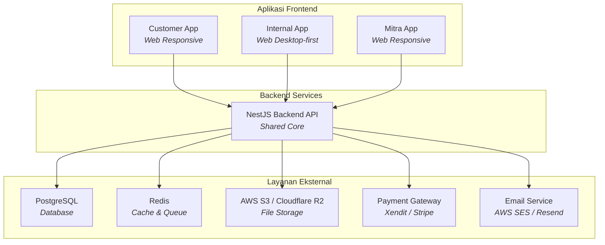

### 6.2 Deskripsi Tiap Platform

#### Customer App
- **Fungsi:** Platform utama untuk pelanggan mencari, melihat, dan memesan penginapan.
- **Tampilan:** Responsive (desktop & mobile). Bukan mobile-only.
- **Bahasa:** Multi-language (Indonesia, English, Arabic untuk MVP).
- **Fitur utama:** Pencarian, detail unit, booking, pembayaran, e-voucher, riwayat booking, order history, chat CS.

#### Internal App
- **Fungsi:** Dashboard admin internal untuk operasional platform.
- **Akses:** Berbasis role (role-based access control).
- **Fitur utama:** Approval mitra, approval unit, approval harga, manajemen hidden gem, manajemen informasi Muslim-friendly, customer support, pelaporan, **manajemen wallet & withdrawal mitra**, order history & audit.

#### Mitra App
- **Fungsi:** Dashboard bagi mitra untuk mengelola unit dan booking.
- **Tampilan:** Responsive.
- **Fitur utama:** Manajemen unit (CRUD + foto), manajemen booking, check-in/check-out, pengaturan harga, konsultasi, **wallet & riwayat keuangan**, **pengajuan withdrawal**.

### 6.3 Sistem Autentikasi

| Aspek | Keputusan | Alasan |
|---|---|---|
| **Metode Login** | Email & Password | Lebih simpel dan bersifat global (tidak bergantung operator seluler negara tertentu). Nomor HP lokal bisa jadi hambatan bagi turis mancanegara. |
| **Registrasi** | Data umum/general | Belum perlu identitas lengkap di tahap awal. Cukup nama, email, password. |
| **Aktivasi** | Email verification | Standar industri untuk validasi akun. |

### 6.4 Prototype

- Untuk tahap awal, prototype dibuat **mobile-only** pada customer app.
- **Alasan:** Membuat prototype full responsive membutuhkan effort yang terlalu besar untuk tahap validasi konsep.
- Prototype ini digunakan untuk validasi UX dan feedback awal sebelum development penuh.

---

## 7. Fitur & Fungsionalitas

### 7.1 Customer App — Fitur Lengkap

| # | Fitur | Deskripsi | Prioritas |
|---|---|---|---|
| 1 | **Registrasi & Login** | Daftar dengan email, verifikasi akun, login. | MVP |
| 2 | **Pencarian Penginapan** | Cari berdasarkan lokasi, tanggal, jumlah tamu, filter (harga, fasilitas, Muslim-friendly). | MVP |
| 3 | **Detail Unit** | Halaman detail dengan foto, deskripsi, fasilitas, harga, lokasi map, info Muslim-friendly (jika ada). | MVP |
| 4 | **Booking Flow** | Pilih tanggal, pilih kamar/unit, isi data tamu, review pesanan. | MVP |
| 5 | **Pembayaran** | Integrasi payment gateway, multiple metode pembayaran. | MVP |
| 6 | **E-Voucher** | Kode booking digital yang diterima setelah pembayaran berhasil. | MVP |
| 7 | **Riwayat Booking** | Daftar semua booking (aktif, selesai, dibatalkan). | MVP |
| 8 | **Order History** | Riwayat lengkap seluruh transaksi dan aktivitas booking dengan detail status dan timeline perubahan. Mendukung kebutuhan audit dan pelacakan. | MVP |
| 9 | **Multi-bahasa** | Indonesia & English untuk MVP. Arabic untuk fase berikutnya. | MVP (ID+EN) |
| 10 | **Info Muslim-Friendly** | Badge/tag pada listing, informasi tempat ibadah & makanan halal terdekat di halaman detail. | MVP |
| 11 | **Hidden Gem** | Section khusus di homepage, badge visual, konten lebih kaya. | MVP |
| 12 | **Chat CS** | In-platform chat dengan customer service. | Post-MVP |
| 13 | **Review & Rating** | Customer bisa memberi review setelah check-out. | Post-MVP |
| 14 | **Wishlist/Favorit** | Simpan unit favorit. | Post-MVP |
| 15 | **Notifikasi** | Email notification untuk konfirmasi booking, reminder check-in, dll. | MVP |
| 16 | **Refund Request** | Pengajuan refund via CS (bukan self-service). | MVP |
| 17 | **Guest Checkout Flow** | Bisa cari & pilih unit sebagai guest, redirect ke registrasi, lalu lanjut checkout yang tertunda. | MVP |

### 7.2 Mitra App — Fitur Lengkap

| # | Fitur | Deskripsi | Prioritas |
|---|---|---|---|
| 1 | **Registrasi & Aktivasi** | Daftar akun mitra, menunggu approval. | MVP |
| 2 | **Dashboard** | Ringkasan booking, pendapatan, status unit, saldo wallet. | MVP |
| 3 | **Manajemen Unit** | CRUD unit: detail, foto, fasilitas, deskripsi menarik. | MVP |
| 4 | **Manajemen Harga** | Set harga dasar per unit/kamar. Perubahan harga butuh approval platform. | MVP |
| 5 | **Manajemen Booking** | Lihat daftar booking masuk, detail booking. | MVP |
| 6 | **Check-in / Check-out** | Terima kode booking dari customer. Auto check-in saat masuk waktu check-in. Jika tidak ada interaksi/refund, customer dianggap sudah check-in. | MVP |
| 7 | **Wallet** | Menampilkan saldo terkini, riwayat pemasukan dari booking yang selesai, dan riwayat withdrawal. | MVP |
| 8 | **Pengajuan Withdrawal** | Mitra dapat mengajukan penarikan saldo wallet ke rekening bank yang terdaftar. Proses diverifikasi oleh admin internal. | MVP |
| 9 | **Order History** | Riwayat lengkap seluruh transaksi (booking masuk, settlement, withdrawal) dengan timeline dan status. Mendukung rekonsiliasi keuangan mitra. | MVP |
| 10 | **Konsultasi** | Endpoint untuk konsultasi — redirect ke direct chat/platform sosial. | MVP |
| 11 | **Notifikasi** | Notifikasi booking baru, perubahan status, settlement masuk, status withdrawal. | MVP |
| 12 | **Laporan** | Laporan booking & pendapatan. | Post-MVP |

### 7.3 Internal App — Fitur Lengkap

| # | Fitur | Deskripsi | Prioritas |
|---|---|---|---|
| 1 | **Login + Role Access** | Login admin dengan pembagian role dan akses berbeda. | MVP |
| 2 | **Approval Mitra** | Review dan approve/reject pendaftaran mitra. | MVP |
| 3 | **Approval Unit** | Review dan approve/reject unit yang didaftarkan mitra. | MVP |
| 4 | **Approval Harga** | Review dan approve/reject perubahan harga dari mitra. | MVP |
| 5 | **Manajemen Hidden Gem** | Flagging unit sebagai hidden gem, tambah konten/informasi ekstra. | MVP |
| 6 | **Manajemen Info Muslim-Friendly** | Kelola data tempat ibadah, restoran halal, fasilitas Muslim-friendly. Ini di-maintain internal, bukan oleh mitra. | MVP |
| 7 | **Customer Support** | Handle request refund dan keluhan customer. | MVP |
| 8 | **Manajemen Wallet Mitra** | Melihat saldo wallet seluruh mitra, riwayat settlement, dan audit trail. | MVP |
| 9 | **Manajemen Withdrawal** | Review, approve, dan proses pengajuan withdrawal dari mitra secara manual. Termasuk pencatatan bukti transfer. | MVP |
| 10 | **Order History & Audit** | Riwayat lengkap seluruh transaksi platform (booking, pembayaran, settlement, withdrawal, refund) dengan kemampuan pencarian, filter, dan export untuk keperluan audit. | MVP |
| 11 | **Dashboard & Pelaporan** | Statistik booking, pendapatan, mitra aktif, saldo wallet keseluruhan, dll. | MVP (Basic) |
| 12 | **Manajemen Konten** | Kelola konten editorial untuk hidden gem. | Post-MVP |

### 7.4 Fitur Overbooking

- **Penanganan overbooking sepenuhnya menjadi tanggung jawab pemilik unit/mitra.**
- Jika unit sudah fully booked, tidak ada lagi transaksi baru yang masuk ke platform untuk unit tersebut.
- Platform memastikan stok unit akurat berdasarkan data dari mitra.
- Mitra bertanggung jawab mengatur ketersediaan unit di sistem mereka.

### 7.5 Fitur Konsultasi

- Fitur konsultasi bersifat **endpoint redirect** — bukan chat in-platform.
- Secara teknis, mengarahkan ke direct chat (WhatsApp/Telegram) atau platform sosial lain.
- **Alasan:** Membangun fitur chat lengkap dalam platform membutuhkan effort signifikan.
- **Rekomendasi untuk kedepannya:** Jika platform berkembang, pertimbangkan in-platform chat dengan CS sebagai prioritas lebih tinggi dibanding chat mitra.

### 7.6 Fitur Wallet

Wallet adalah **fitur inti** dalam sistem keuangan platform yang menjadi penghubung antara transaksi booking dan pencairan dana ke mitra.

#### Konsep Wallet

| Aspek | Penjelasan |
|---|---|
| **Pemilik Wallet** | Setiap mitra yang sudah approved memiliki 1 wallet. |
| **Sumber Saldo** | Saldo berasal dari bagian mitra (harga dasar) setiap booking yang statusnya sudah **selesai** (check-out). |
| **Penggunaan** | Saldo hanya dapat ditarik (withdrawal) ke rekening bank yang terdaftar. |
| **Visibilitas** | Mitra dapat melihat saldo, riwayat pemasukan, dan riwayat withdrawal secara real-time. |

#### Informasi yang Ditampilkan di Wallet Mitra

1. **Saldo Tersedia** — jumlah saldo yang bisa ditarik saat ini.
2. **Saldo Tertahan** — saldo dari booking yang belum selesai (masih pending/check-in).
3. **Total Pemasukan** — akumulasi total pendapatan dari seluruh booking.
4. **Riwayat Transaksi** — daftar lengkap setiap mutasi masuk (settlement) dan keluar (withdrawal).

### 7.7 Fitur Withdrawal

Withdrawal adalah proses penarikan saldo wallet mitra ke rekening bank.

#### Mekanisme Withdrawal

| Aspek | Kebijakan |
|---|---|
| **Inisiasi** | Dilakukan oleh mitra melalui Mitra App. |
| **Verifikasi & Proses** | Dilakukan **manual oleh admin internal** melalui Internal App. |
| **Rekening Tujuan** | Rekening bank yang sudah terdaftar dan terverifikasi pada profil mitra. |
| **Minimum Withdrawal** | TBD — perlu keputusan bisnis (rekomendasi: IDR 100.000). |
| **Jadwal Proses** | TBD — rekomendasi: diproses dalam 1–3 hari kerja setelah pengajuan. |

#### Status Withdrawal

| Status | Penjelasan |
|---|---|
| **Diajukan** | Mitra sudah submit request withdrawal. |
| **Diproses** | Admin sedang memverifikasi dan memproses transfer. |
| **Selesai** | Dana sudah ditransfer ke rekening mitra. Bukti transfer dicatat di sistem. |
| **Ditolak** | Pengajuan ditolak oleh admin (misalnya: data rekening tidak valid). Saldo dikembalikan ke wallet. |

### 7.8 Fitur Order History

Order history adalah **sistem pencatatan riwayat transaksi** yang mendukung kebutuhan audit, pelacakan, dan transparansi di seluruh platform.

#### Cakupan Order History per Platform

| Platform | Data yang Dicatat | Kegunaan |
|---|---|---|
| **Customer App** | Riwayat booking (termasuk timeline perubahan status), riwayat pembayaran, e-voucher yang pernah diterbitkan, riwayat refund. | Customer dapat melacak status booking dan histori transaksi. |
| **Mitra App** | Riwayat booking masuk, settlement yang diterima, pengajuan withdrawal dan statusnya, mutasi wallet. | Mitra dapat melakukan rekonsiliasi keuangan mandiri. |
| **Internal App** | Seluruh transaksi platform: booking, pembayaran, settlement, withdrawal, refund. Termasuk log siapa yang melakukan approval/perubahan. | Audit trail lengkap untuk operasional dan compliance. |

#### Prinsip Order History

1. **Immutable** — setiap perubahan status tercatat sebagai entry baru, tidak menimpa data lama.
2. **Timestamped** — setiap event dicatat dengan waktu yang presisi.
3. **Traceable** — setiap aksi terkait dengan user yang melakukannya (customer, mitra, atau admin).
4. **Searchable** — mendukung pencarian berdasarkan ID booking, nama customer, tanggal, status, dan parameter lainnya.
5. **Exportable** — data dapat di-export untuk keperluan audit dan pelaporan (minimal CSV/Excel).

---

## 8. Sistem Keuangan & Settlement

### 8.1 Alur Keuangan End-to-End

Berikut adalah gambaran lengkap alur keuangan dari pembayaran customer hingga pencairan dana ke mitra:

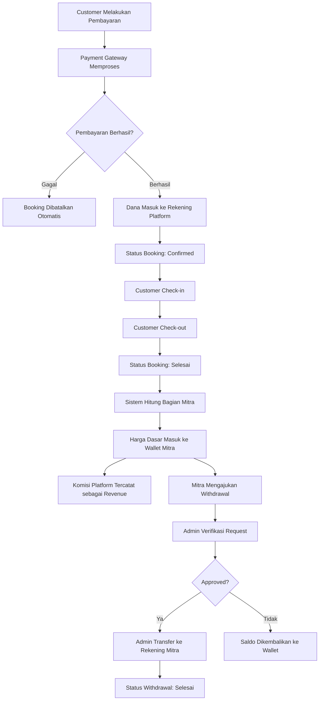

### 8.2 Struktur Settlement

| Komponen | Penjelasan |
|---|---|
| **Harga yang Dibayar Customer** | Harga dasar mitra + markup platform |
| **Bagian Mitra** | Harga dasar (sesuai yang ditetapkan mitra dan disetujui platform) |
| **Bagian Platform** | Markup/komisi (15–20% dari harga dasar) |
| **Waktu Settlement** | Saldo masuk ke wallet mitra setelah status booking = **Selesai** |

### 8.3 Kebijakan Holding Period

| Kondisi | Perlakuan |
|---|---|
| **Booking aktif (belum check-out)** | Dana ditahan di rekening platform. Belum masuk ke wallet mitra. |
| **Booking selesai (check-out)** | Bagian mitra langsung masuk ke wallet sebagai saldo tersedia. |
| **Booking dibatalkan + refund** | Dana dikembalikan ke customer. Tidak ada settlement ke mitra. |
| **No-show (auto check-in, tanpa refund)** | Dianggap selesai. Settlement ke mitra berjalan normal. |

### 8.4 Rekonsiliasi & Audit

- Setiap transaksi keuangan dicatat dalam **ledger internal** dengan informasi lengkap:
  - ID transaksi
  - Tipe transaksi (pembayaran, settlement, withdrawal, refund)
  - Jumlah
  - Timestamp
  - Aktor (customer/mitra/admin yang melakukan aksi)
  - Status
  - Referensi ke booking terkait
- Admin internal dapat mengakses laporan rekonsiliasi kapan saja.
- Data mendukung kebutuhan audit keuangan dan compliance.

---

## 9. Alur Pengguna (User Flow)

### 9.1 Alur Customer — Sebagai Guest

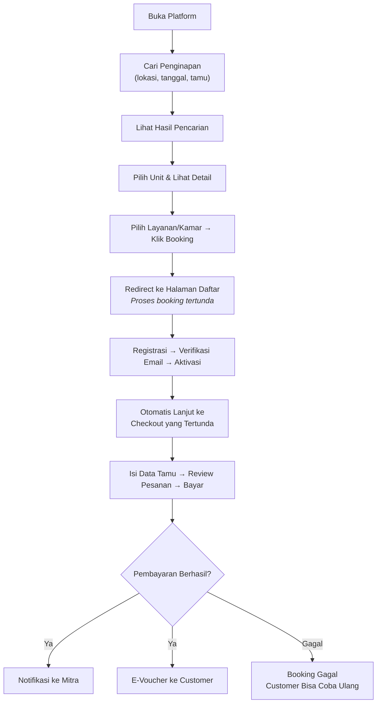

> **Penting:** Pengalaman guest harus seamless. Setelah registrasi, customer langsung dilanjutkan ke proses checkout yang tertunda — **bukan mulai dari awal**.

### 9.2 Alur Customer — Sudah Terdaftar

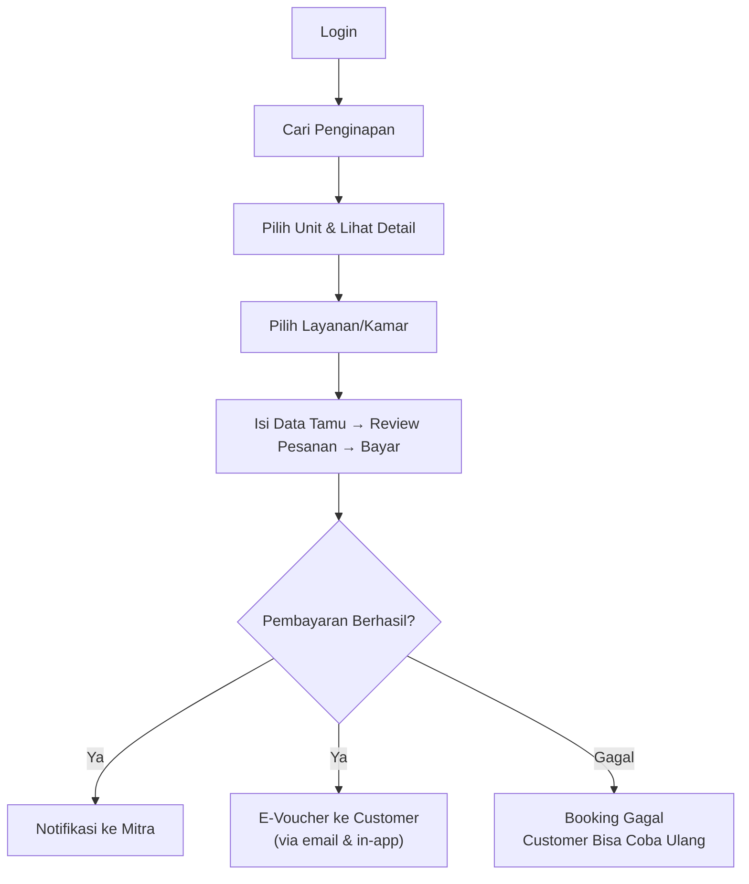

### 9.3 Alur Check-in / Check-out

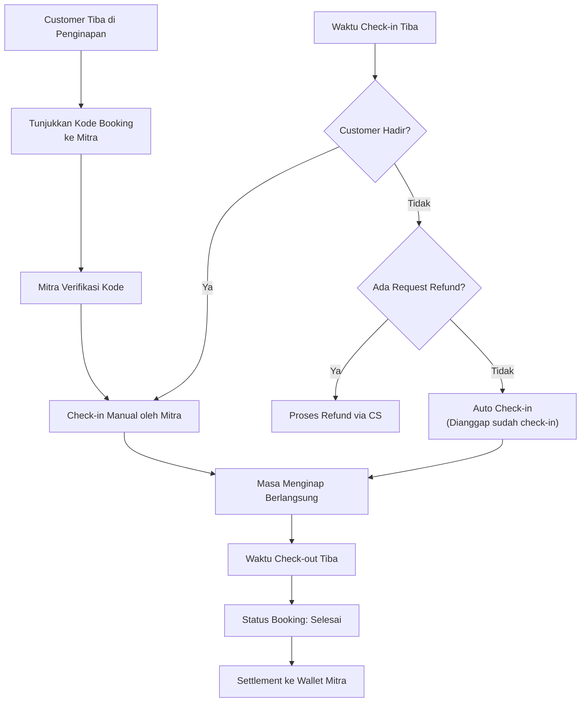

### 9.4 Alur Mitra

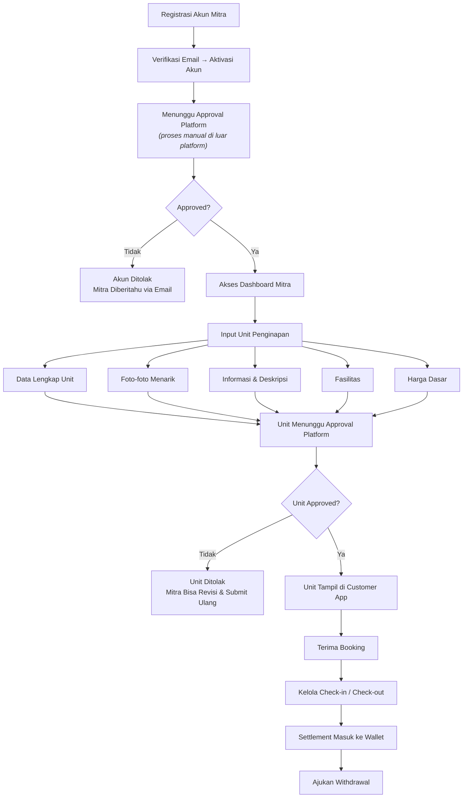

### 9.5 Alur Refund

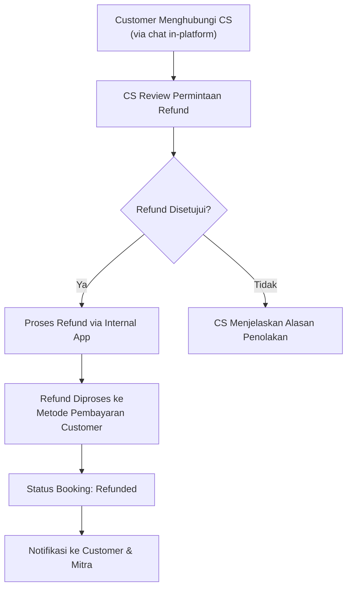

> **Catatan:** Saat ini refund bersifat manual via CS. Belum ada self-service refund.

### 9.6 Alur Wallet & Withdrawal

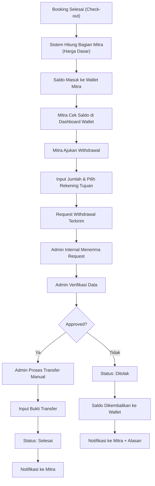

---

## 10. Siklus Status Booking

### 10.1 Definisi Status Booking

Setiap booking memiliki siklus status yang jelas dan terstruktur. Berikut adalah seluruh status yang mungkin:

| Status | Deskripsi | Trigger |
|---|---|---|
| **Pending Payment** | Booking dibuat, menunggu pembayaran. | Customer submit booking. |
| **Payment Expired** | Pembayaran tidak dilakukan dalam batas waktu. | Sistem otomatis (timeout). |
| **Confirmed** | Pembayaran berhasil, booking dikonfirmasi. | Callback sukses dari payment gateway. |
| **Checked-in** | Customer sudah check-in di penginapan. | Verifikasi manual oleh mitra atau auto check-in oleh sistem. |
| **Completed** | Booking selesai, check-out berhasil. | Waktu check-out tiba atau manual oleh mitra. |
| **Cancelled** | Booking dibatalkan sebelum check-in. | Request dari customer via CS (sebelum check-in). |
| **Refunded** | Dana sudah dikembalikan ke customer. | Admin memproses refund setelah pembatalan disetujui. |

### 10.2 Diagram Siklus Status Booking

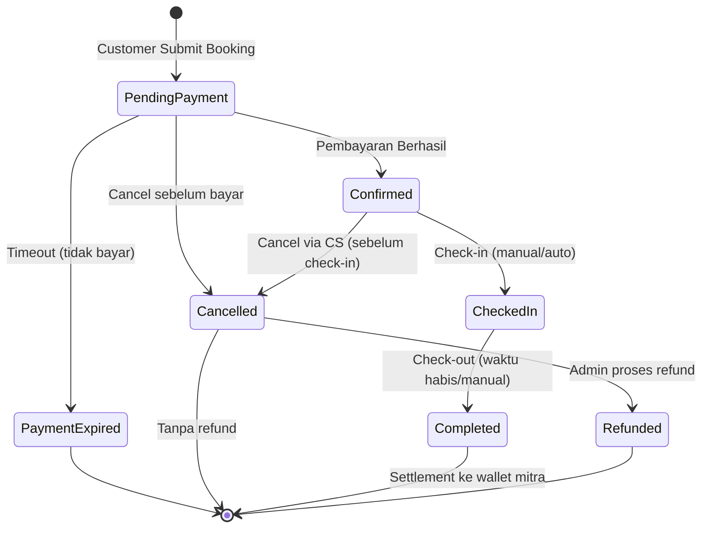

### 10.3 Aturan Transisi Status

| Dari | Ke | Kondisi |
|---|---|---|
| Pending Payment | Confirmed | Payment gateway kirim callback sukses |
| Pending Payment | Payment Expired | Melewati batas waktu pembayaran (rekomendasi: 1 jam) |
| Pending Payment | Cancelled | Customer membatalkan sebelum membayar |
| Confirmed | Checked-in | Mitra verifikasi kode booking ATAU waktu check-in tercapai (auto) |
| Confirmed | Cancelled | Customer request cancel via CS, disetujui admin |
| Checked-in | Completed | Waktu check-out tercapai ATAU mitra konfirmasi manual |
| Cancelled | Refunded | Admin memproses pengembalian dana |

### 10.4 Batas Waktu Pembayaran

- Booking yang belum dibayar akan otomatis expire setelah **1 jam** (rekomendasi).
- Setelah expire, unit kembali tersedia untuk customer lain.
- Customer yang booking-nya expire dapat membuat booking baru.

---

## 11. Strategi Harga & Pembayaran

### 11.1 Struktur Harga

| Aspek | Kebijakan |
|---|---|
| **Harga Dasar** | Ditentukan oleh mitra |
| **Markup Platform** | Persentase di atas harga dasar (rekomendasi: 15–20%) |
| **Perubahan Harga** | Mitra harus request → approval dari platform → baru tampil |
| **Harga Tampil ke Customer** | Harga dasar + markup platform |

### 11.2 Dynamic Pricing

| Status Saat Ini | Rencana Kedepan |
|---|---|
| **Harga tetap (fixed price)** — tidak ada penyesuaian musiman. Bahkan saat high season, harga tidak berubah. Ini diposisikan sebagai "promo". | Arsitektur harus **siap untuk implementasi dynamic pricing** di masa depan. Struktur database dan API harus mengakomodasi variabel musim, demand, dan event. |

**Rekomendasi arsitektur dynamic pricing (untuk disiapkan):**
- Tabel harga terpisah per periode (date range pricing)
- Flag untuk seasonal adjustment
- Rule engine sederhana yang bisa diaktifkan saat siap

### 11.3 Pembayaran

| Aspek | Detail |
|---|---|
| **Model** | Payment gateway sebagai e-commerce |
| **Cakupan** | Harus support pembayaran domestik Indonesia **dan** mancanegara |
| **Strategi** | Gunakan **lebih dari 1 payment gateway** untuk coverage optimal |

**Rekomendasi Payment Gateway:**

| Gateway | Kekuatan | Cakupan |
|---|---|---|
| **Xendit** | Kuat di Indonesia, mendukung VA, e-wallet, kartu kredit/debit. Mulai ekspansi ke Asia Tenggara. | Domestik + regional |
| **Stripe** | Global, mendukung 135+ mata uang, 46+ negara. Fitur lengkap. | Internasional |
| **Midtrans (by GoTo)** | Dominan di Indonesia, integrasi mudah. | Domestik |

**Strategi yang direkomendasikan:**
- **MVP:** Gunakan **Xendit** sebagai gateway utama (domestik kuat + mulai mendukung internasional).
- **Post-MVP:** Tambahkan **Stripe** untuk coverage internasional yang lebih luas.
- **Routing logic:** Backend menentukan gateway berdasarkan negara/metode pembayaran customer.

> **Catatan penting:** Setiap payment gateway memiliki biaya transaksi (biasanya 2–4% per transaksi). Ini harus diperhitungkan dalam struktur pricing.

### 11.4 Penanganan Pembayaran Gagal

| Skenario | Perlakuan |
|---|---|
| **Payment timeout** | Booking otomatis dibatalkan, unit kembali tersedia. Customer diberitahu via notifikasi. |
| **Payment gateway error** | Customer diarahkan untuk mencoba ulang. Booking tetap di status "Pending Payment" selama belum expire. |
| **Partial payment (double charge)** | Dicatat di sistem, admin memproses refund selisih secara manual. |
| **Callback belum diterima** | Sistem melakukan polling/retry ke payment gateway untuk mengecek status. |

---

## 12. Desain & Pengalaman Pengguna (UX)

### 12.1 Identitas Visual

| Elemen | Keputusan |
|---|---|
| **Warna Primer** | Biru langit (Sky Blue) |
| **Kesan yang ingin dibangun** | Segar, terpercaya, tenang, profesional |
| **Tampilan** | Responsive (desktop & mobile) — bukan mobile-only |

**Rekomendasi palet warna:**
- Primary: Sky Blue `#4AABF0` (atau variasi serupa)
- Secondary: Warm White `#F8FAFB`
- Accent: Soft Gold `#F0B756` (untuk CTA dan highlight)
- Text: Dark Gray `#2D3436`
- Success: Green `#27AE60`
- Warning: Orange `#F39C12`
- Error: Red `#E74C3C`

### 12.2 UX Muslim-Friendly Information

**Pertanyaan dari catatan:** *"Belum kepikiran gimana UX dan UI-nya. Apakah di tiap detail mitra service atau UI terpisah?"*

**Rekomendasi — Pendekatan terintegrasi (bukan halaman terpisah):**

1. **Pada listing card (hasil pencarian):**
   - Badge kecil "Muslim-Friendly" pada card unit yang memenuhi kriteria.
   - Ikon kecil (masjid, halal food) sebagai visual indicator.

2. **Pada halaman detail unit:**
   - Section khusus "Informasi Sekitar" yang menampilkan:
     - Tempat ibadah terdekat (masjid, mushola) + jarak & arah.
     - Restoran/tempat makan halal terdekat + jarak.
     - Fasilitas Muslim-friendly yang tersedia di unit (sajadah, arah kiblat, dll).
   - Informasi ini ditampilkan secara natural bersama informasi unit lain, **bukan di tab/halaman terpisah**.

3. **Pada filter pencarian:**
   - Opsi filter "Muslim-Friendly" — bersifat opsional, bukan default.

**Alasan pendekatan ini:**
- Tidak membuat platform terasa "eksklusif Muslim" — informasi tersedia tapi tidak memaksa.
- Informasi berguna bagi semua orang (siapa saja mungkin ingin tahu lokasi tempat makan halal).
- Pengalaman browsing tetap konsisten — tidak perlu navigasi ke halaman lain.

> **Penting:** Informasi Muslim-friendly **di-maintain secara internal** oleh tim platform, bukan oleh mitra. Ini menjaga kualitas dan konsistensi data.

### 12.3 UX Hidden Gem

**Rekomendasi desain hidden gem:**

1. **Di Homepage:**
   - Section "Hidden Gem" yang menonjol dengan desain berbeda (full-width carousel, foto besar).
   - Narasi editorial pendek yang menarik.

2. **Pada listing card:**
   - Badge "Hidden Gem" dengan desain premium/istimewa (misalnya ikon berlian atau bintang).
   - Visual treatment berbeda (misalnya border gold/accent).

3. **Pada halaman detail:**
   - Konten lebih kaya dibanding unit reguler:
     - Foto lebih banyak dan berkualitas tinggi.
     - Narasi editorial (cerita di balik tempat tersebut).
     - Informasi area dan aktivitas sekitar.
     - Tips khusus dari tim platform.

**Diferensiasi hidden gem vs reguler:**

| Aspek | Unit Reguler | Hidden Gem |
|---|---|---|
| Foto | Dari mitra | Dikurasi + ditambah oleh platform |
| Deskripsi | Dari mitra | Ditambah narasi editorial |
| Info Sekitar | Standar | Lebih lengkap & detail |
| Badge | Tidak ada | Badge "Hidden Gem" |
| Posisi di Homepage | Tidak ditampilkan khusus | Featured section |
| Maintenance | Oleh mitra | Oleh platform |

### 12.4 UX Wallet & Withdrawal (Mitra App)

**Rekomendasi desain wallet pada Mitra App:**

1. **Dashboard Wallet:**
   - Ditampilkan sebagai card utama di dashboard mitra.
   - Menunjukkan: saldo tersedia, saldo tertahan, dan tombol "Tarik Dana".
   - Warna card menggunakan accent agar menonjol.

2. **Halaman Wallet Detail:**
   - Tab "Riwayat Pemasukan" — daftar settlement per booking.
   - Tab "Riwayat Penarikan" — daftar withdrawal beserta statusnya.
   - Filter berdasarkan tanggal dan status.

3. **Flow Withdrawal:**
   - Tombol "Tarik Dana" → form input jumlah → konfirmasi rekening tujuan → submit.
   - Status withdrawal ditampilkan dengan badge warna:
     - Diajukan: Kuning
     - Diproses: Biru
     - Selesai: Hijau
     - Ditolak: Merah

4. **Notifikasi:**
   - Email notification saat settlement masuk ke wallet.
   - Email notification saat status withdrawal berubah.

### 12.5 UX Order History

**Rekomendasi desain order history:**

1. **Customer App:**
   - Halaman "Riwayat Pesanan" yang menampilkan semua booking dalam bentuk timeline.
   - Setiap booking menampilkan: nama penginapan, tanggal, status, dan total harga.
   - Klik detail menampilkan timeline perubahan status booking secara kronologis.

2. **Mitra App:**
   - Tab "Riwayat Transaksi" di halaman keuangan.
   - Tabel yang bisa difilter berdasarkan tipe transaksi, tanggal, dan status.
   - Setiap entry menampilkan: ID booking, nama customer, jumlah, tipe, dan status.

3. **Internal App:**
   - Halaman "Audit Trail" dengan kemampuan pencarian lanjutan.
   - Filter: tanggal, tipe transaksi, mitra, customer, status, admin yang memproses.
   - Fitur export ke CSV/Excel.
   - Detail view menampilkan seluruh event yang terjadi pada satu transaksi.

### 12.6 Multi-Bahasa

| Bahasa | Fase | Catatan |
|---|---|---|
| Bahasa Indonesia | MVP | Default |
| English | MVP | Untuk turis internasional |
| Arabic (العربية) | Post-MVP (prioritas tinggi) | Penting untuk segmen Timur Tengah. RTL layout perlu diperhatikan. |

**Catatan dari notes:** *"Kalau nurutin semuanya, Unicode-nya terlalu banyak bisa conflict ini effortnya lumayan."*

**Rekomendasi:**
- MVP: Indonesia + English saja (mengurangi effort signifikan).
- Arabic ditambahkan segera setelah MVP stabil (memerlukan RTL layout support yang butuh effort desain tersendiri).
- Gunakan library i18n yang mature (next-intl atau react-i18next) yang sudah handle Unicode dan RTL dengan baik.

### 12.7 Fitur Chat CS

**Keputusan:** Chat **in-platform** — bukan menggunakan omnichannel / platform eksternal.

**Rekomendasi implementasi:**
- **MVP:** Implementasikan fitur chat sederhana (text-based) antara customer dan CS menggunakan WebSocket.
- **Post-MVP:** Tambahkan fitur seperti file attachment, quick replies, chat history.
- **Alternatif MVP jika effort terlalu besar:** Gunakan widget chat dari provider seperti Tawk.to (gratis) atau Crisp sebagai stopgap, lalu ganti dengan in-house solution nanti.

---

## 13. Rekomendasi Technology Stack

### 13.1 Kriteria Pemilihan

Berdasarkan kebutuhan proyek:
- **Powerful** — mampu handle kompleksitas fitur (booking engine, real-time chat, multi-gateway payment, wallet system).
- **Stabil untuk jangka panjang** — teknologi mature, komunitas besar, tidak mudah deprecated.
- **Developer availability** — mudah menemukan developer kompeten di Indonesia.
- **Time-to-market** — memungkinkan development cepat untuk MVP.

### 13.2 Stack yang Direkomendasikan

#### Backend

| Komponen | Teknologi | Alasan |
|---|---|---|
| **Bahasa** | TypeScript (Node.js) | Type-safety, ekosistem besar, talent pool luas di Indonesia |
| **Framework** | NestJS | Arsitektur modular, terinspirasi Angular, cocok untuk enterprise. Built-in support untuk WebSocket, microservices, dan guard/decorator. |
| **Database Utama** | PostgreSQL | Battle-tested, relational, cocok untuk data booking/transaksi/wallet, support JSON untuk data fleksibel |
| **Cache** | Redis | Session management, caching, real-time features |
| **Search** | PostgreSQL Full-Text Search (MVP) → Elasticsearch (scale) | MVP tidak perlu search engine terpisah. Upgrade ke Elasticsearch saat data besar. |
| **File Storage** | AWS S3 (atau Cloudflare R2 untuk hemat biaya) | Standar industri untuk foto/file |
| **Message Queue** | BullMQ (Redis-based) | Untuk background jobs: email, notifikasi, payment callback, settlement processing |
| **Real-time** | Socket.io (via NestJS Gateway) | Untuk fitur chat CS |

#### Frontend

| Komponen | Teknologi | Alasan |
|---|---|---|
| **Framework** | Next.js 14+ (App Router) | SSR/SSG untuk SEO, routing bawaan, mature, performa tinggi |
| **Bahasa** | TypeScript | Konsisten dengan backend, type-safety |
| **Styling** | Tailwind CSS | Utility-first, rapid development, mudah maintain, responsive built-in |
| **State Management** | TanStack Query (React Query) + Zustand | React Query untuk server state, Zustand untuk client state ringan |
| **i18n** | next-intl | Terintegrasi baik dengan Next.js, support RTL (untuk Arabic nanti) |
| **Maps** | Leaflet (gratis) atau Google Maps | Untuk tampilan lokasi unit dan nearby places |
| **Form** | React Hook Form + Zod | Validasi form yang type-safe |

#### Infrastructure

| Komponen | Teknologi | Alasan |
|---|---|---|
| **Containerization** | Docker | Standar deployment modern |
| **Orchestration** | Docker Compose (MVP) → Kubernetes (scale) | Sederhana di awal, scalable nanti |
| **Cloud** | AWS atau GCP | Reliable, lengkap, region Jakarta tersedia |
| **CI/CD** | GitHub Actions | Terintegrasi dengan repo, gratis untuk tier dasar |
| **CDN** | Cloudflare | Performa, DDoS protection, gratis tier besar |
| **Monitoring** | Sentry (error) + Grafana (metrics) | Standar industri |
| **Email** | AWS SES atau Resend | Transactional email (verifikasi, booking confirmation) |

### 13.3 Alasan Tidak Memilih Alternatif

| Alternatif | Alasan Tidak Dipilih |
|---|---|
| **Go (Golang)** | Performa lebih tinggi, tapi talent pool di Indonesia lebih kecil. Learning curve lebih tinggi. Untuk skala MVP ini, TypeScript/NestJS sudah lebih dari cukup. |
| **Python/Django** | Cocok untuk rapid prototyping, tapi kurang performa untuk real-time features. Type-safety tidak sekuat TypeScript. |
| **PHP/Laravel** | Talent pool besar di Indonesia, tapi kurang ideal untuk real-time (chat) dan arsitektur modern. |
| **Vue/Nuxt** | Bagus, tapi ekosistem React/Next.js lebih besar, terutama untuk komponen UI dan library pihak ketiga. |
| **React Native / Flutter** | Saat ini fokus web. Jika butuh mobile app di masa depan, Next.js PWA bisa jadi bridge solution. |

### 13.4 Diagram Arsitektur Teknis

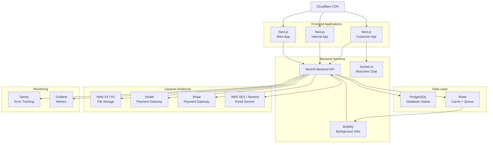

---

## 14. Perencanaan MVP

### 14.1 Prinsip MVP

MVP (Minimum Viable Product) dipilih agar platform **sudah bisa digunakan untuk jualan dan mendapatkan client** secepat mungkin, walaupun belum semua fitur tersedia.

**Kriteria seleksi fitur MVP:**
1. Apakah fitur ini **diperlukan** agar customer bisa booking?
2. Apakah fitur ini **diperlukan** agar mitra bisa mengelola unit?
3. Apakah fitur ini **diperlukan** agar platform bisa beroperasi?
4. Apakah fitur ini menjadi **diferensiasi utama** platform?
5. Apakah fitur ini **diperlukan** agar alur keuangan (settlement & withdrawal) berjalan?

### 14.2 Fitur MVP

#### Customer App (MVP)

| Fitur | Keterangan |
|---|---|
| Registrasi & Login (Email) | Termasuk verifikasi email |
| Guest Checkout Flow | Cari → pilih → redirect daftar → lanjut checkout |
| Pencarian + Filter Dasar | Lokasi, tanggal, harga, Muslim-friendly filter |
| Halaman Detail Unit | Foto, deskripsi, fasilitas, harga, lokasi |
| Info Muslim-Friendly | Badge + section informasi di detail unit |
| Hidden Gem | Featured section di homepage + badge |
| Booking Flow | Pilih tanggal, isi data, review, bayar |
| Integrasi Payment | 1 gateway (Xendit) |
| E-Voucher (Kode Booking) | Dikirim via email setelah pembayaran sukses |
| Riwayat Booking | Daftar booking customer |
| Order History | Riwayat transaksi lengkap dengan timeline status |
| Multi-bahasa | Indonesia + English |
| Responsive Design | Desktop + mobile |

#### Mitra App (MVP)

| Fitur | Keterangan |
|---|---|
| Registrasi & Login | Termasuk aktivasi akun |
| Dashboard Ringkasan | Jumlah booking, status unit, saldo wallet |
| Manajemen Unit | Tambah, edit, hapus unit + upload foto |
| Manajemen Harga | Set & update harga (dengan flow approval) |
| Daftar Booking | Lihat booking yang masuk |
| Check-in / Check-out | Verifikasi kode booking, auto check-in |
| Wallet | Saldo tersedia, saldo tertahan, riwayat mutasi |
| Pengajuan Withdrawal | Request penarikan saldo ke rekening bank |
| Order History | Riwayat transaksi (booking, settlement, withdrawal) |
| Notifikasi | Email notifikasi booking baru, settlement, status withdrawal |

#### Internal App (MVP)

| Fitur | Keterangan |
|---|---|
| Login + Role Access | Admin dengan pembagian role |
| Approval Mitra | Approve / reject mitra baru |
| Approval Unit | Approve / reject unit baru |
| Approval Harga | Approve / reject perubahan harga |
| Manajemen Hidden Gem | Flagging + tambah info hidden gem |
| Manajemen Info Muslim-Friendly | CRUD data tempat ibadah, makanan halal |
| Handle Refund | Proses refund via CS |
| Manajemen Wallet Mitra | Lihat saldo & riwayat wallet seluruh mitra |
| Manajemen Withdrawal | Review, approve, proses withdrawal manual |
| Order History & Audit | Riwayat seluruh transaksi platform, pencarian & filter, export data |
| Dashboard Dasar | Statistik booking, mitra, pendapatan, saldo wallet keseluruhan |

#### Backend (MVP)

| Komponen | Keterangan |
|---|---|
| Core API | Auth, unit, booking, payment, notification, wallet, withdrawal |
| Database Design | Schema untuk semua entitas utama termasuk wallet & ledger |
| Payment Integration | Xendit (1 gateway) |
| Settlement Engine | Proses otomatis kalkulasi dan distribusi saldo ke wallet setelah booking selesai |
| Email Notification | Verifikasi akun, konfirmasi booking, e-voucher, notifikasi settlement & withdrawal |
| File Upload | Upload & manage foto unit |
| Keamanan | JWT auth, input validation, rate limiting |
| Audit Trail | Logging seluruh event transaksi untuk kebutuhan audit |

### 14.3 Fitur yang Ditunda ke Post-MVP

| Fitur | Alasan Ditunda | Fase |
|---|---|---|
| Chat CS In-Platform | Effort tinggi, bisa pakai widget chat sementara | Fase 2 |
| Bahasa Arabic + RTL | Butuh effort desain signifikan | Fase 2 |
| Dynamic Pricing | Belum dibutuhkan saat harga masih fixed/promo | Fase 2-3 |
| Review & Rating | Butuh volume booking dulu | Fase 2 |
| Advanced Analytics (Mitra) | Laporan dasar cukup untuk MVP | Fase 2 |
| Payment Gateway ke-2 (Stripe) | 1 gateway cukup untuk validasi pasar | Fase 2 |
| Auto-Withdrawal (Scheduled) | Withdrawal manual cukup untuk volume awal | Fase 3 |
| Self-service Refund | Manual via CS cukup untuk volume awal | Fase 3 |
| Wishlist/Favorit | Nice-to-have, bukan kebutuhan utama | Fase 3 |
| Push Notification | Email cukup untuk MVP | Fase 3 |
| Mobile App (Native) | Web responsive sudah cukup | Fase 4+ |

---

## 15. Estimasi Timeline & Budget

### 15.1 Komposisi Tim

| Role | Jumlah | Level |
|---|---|---|
| Backend Developer (Lead) | 1 | Senior |
| Backend Developer | 1 | Mid |
| Frontend Developer (Lead) | 1 | Senior |
| Frontend Developer | 1 | Mid |
| **Total** | **4** | |

> **Catatan:** Tim ini belum termasuk Product Manager, UI/UX Designer, dan QA. Diasumsikan desain UI/UX sudah disiapkan sebelum atau parallel dengan development.

### 15.2 Timeline MVP (Estimasi 5 Bulan)

> **Catatan:** Timeline diperbarui dari 4 bulan menjadi 5 bulan untuk mengakomodasi fitur tambahan (wallet, withdrawal, order history, settlement engine, audit trail).

#### Bulan 1 — Fondasi

| Tim | Task |
|---|---|
| **Backend** | Setup project (NestJS + PostgreSQL + Redis + Docker), database schema design (termasuk tabel wallet, ledger, withdrawal), API architecture, modul Auth (register, login, verifikasi email, JWT), API CRUD unit dasar |
| **Frontend** | Setup project (Next.js + Tailwind + i18n), design system/komponen dasar, halaman Auth (register, login, verifikasi), homepage layout, komponen pencarian |

#### Bulan 2 — Core Features

| Tim | Task |
|---|---|
| **Backend** | API booking engine (ketersediaan, reservasi, konfirmasi), API manajemen unit lengkap, API pencarian + filter, upload foto (S3), API mitra (registrasi, dashboard) |
| **Frontend** | Halaman hasil pencarian + filter, halaman detail unit (termasuk info Muslim-friendly), booking flow UI, Mitra App: auth + manajemen unit + upload foto |

#### Bulan 3 — Payment & Financial System

| Tim | Task |
|---|---|
| **Backend** | Integrasi payment gateway (Xendit), e-voucher generation, email notification (booking confirmation, e-voucher), settlement engine (kalkulasi & distribusi otomatis ke wallet), API wallet & withdrawal |
| **Frontend** | Halaman pembayaran + status, halaman e-voucher, riwayat booking, Mitra App: dashboard wallet, halaman withdrawal, riwayat transaksi |

#### Bulan 4 — Internal App & Order History

| Tim | Task |
|---|---|
| **Backend** | API Internal App (approval mitra/unit/harga), API manajemen withdrawal (review, approve, reject), API audit trail & order history, API dashboard internal |
| **Frontend** | Internal App: approval flows + dashboard, manajemen wallet mitra, manajemen withdrawal, order history & audit trail, Mitra App: daftar booking + check-in/out |

#### Bulan 5 — Integrasi & Polish

| Tim | Task |
|---|---|
| **Backend** | Integration testing, settlement & wallet testing, bug fixing, performance optimization, security hardening, deployment setup (CI/CD, staging, production) |
| **Frontend** | Guest checkout flow, hidden gem section, multi-bahasa (ID + EN), order history UI (customer + mitra + internal), responsive testing & polishing, cross-browser testing, deployment |

### 15.3 Timeline Full Feature (Estimasi Total 8-9 Bulan)

Setelah MVP (bulan 6-9):

| Bulan | Fitur |
|---|---|
| **6** | Chat CS in-platform (WebSocket/Socket.io), review & rating system |
| **7** | Bahasa Arabic + RTL layout support, payment gateway ke-2 (Stripe) |
| **8** | Dynamic pricing infrastructure, advanced analytics & reporting (mitra + internal), auto-withdrawal scheduled |
| **9** | Refinement, advanced notification, self-service refund, wishlist, optimasi performa |

### 15.4 Estimasi Budget

#### Asumsi Rate Developer (per bulan, Indonesia market 2026)

| Role | Range | Digunakan untuk Estimasi |
|---|---|---|
| Senior Backend Developer | IDR 20.000.000 – 30.000.000 | IDR 25.000.000 |
| Mid Backend Developer | IDR 12.000.000 – 18.000.000 | IDR 15.000.000 |
| Senior Frontend Developer | IDR 20.000.000 – 30.000.000 | IDR 25.000.000 |
| Mid Frontend Developer | IDR 12.000.000 – 18.000.000 | IDR 15.000.000 |

#### Budget Manpower

| Skenario | Durasi | Biaya/Bulan | Total Manpower |
|---|---|---|---|
| **MVP** | 5 bulan | IDR 80.000.000 | **IDR 400.000.000** |
| **Full Feature** | 9 bulan | IDR 80.000.000 | **IDR 720.000.000** |

*Breakdown per bulan: 25M + 15M + 25M + 15M = IDR 80.000.000/bulan*

#### Budget Infrastruktur & Layanan

| Item | Biaya/Bulan (Estimasi) | Catatan |
|---|---|---|
| Cloud Server (AWS/GCP) | IDR 3.000.000 – 8.000.000 | Tergantung skala, bisa mulai kecil |
| Domain + SSL | IDR 500.000 | Per tahun, dibagi per bulan |
| Email Service (SES/Resend) | IDR 500.000 – 1.000.000 | Tergantung volume |
| File Storage (S3/R2) | IDR 500.000 – 2.000.000 | Tergantung volume foto |
| Monitoring (Sentry) | IDR 0 – 500.000 | Free tier biasanya cukup untuk MVP |
| CDN (Cloudflare) | IDR 0 | Free tier |
| **Subtotal Infrastruktur** | **~IDR 5.000.000 – 12.000.000/bulan** | |

#### Budget Payment Gateway

| Item | Biaya | Catatan |
|---|---|---|
| Xendit – Fee per transaksi | ~2.5% – 4% per transaksi | Tergantung metode pembayaran |
| Stripe – Fee per transaksi | ~2.9% + $0.30 per transaksi | Untuk internasional |

> Payment gateway fee bersifat variabel — meningkat seiring volume transaksi. Ini perlu diperhitungkan dalam margin markup.

#### Ringkasan Total Budget

| Skenario | Manpower | Infrastruktur (estimasi) | Total Estimasi |
|---|---|---|---|
| **MVP (5 bulan)** | IDR 400.000.000 | IDR 25.000.000 – 60.000.000 | **IDR 425.000.000 – 460.000.000** |
| **Full (9 bulan)** | IDR 720.000.000 | IDR 45.000.000 – 108.000.000 | **IDR 765.000.000 – 830.000.000** |

> **Catatan:** Budget di atas **belum termasuk** biaya UI/UX Designer, Product Manager, QA tester, legal, dan operasional bisnis lainnya. Jika menggunakan freelance/part-time designer, tambahkan estimasi IDR 10.000.000 – 20.000.000/bulan.

---

## 16. Catatan & Keputusan Tertunda

### 16.1 Keputusan yang Masih Perlu Ditetapkan (TBD)

| # | Item | Status | Catatan |
|---|---|---|---|
| 1 | **Persentase markup harga** | TBD | Perlu keputusan bisnis. Rekomendasi: 15–20%. |
| 2 | **Detail struktur komisi mitra akuisisi vs mitra mandiri** | TBD | Mitra akuisisi kemungkinan markup berbeda karena platform menanggung maintenance. |
| 3 | **Kriteria "Muslim-Friendly"** | TBD | Perlu definisi standar: apa saja yang membuat suatu unit dianggap Muslim-friendly. |
| 4 | **Proses onboarding mitra akuisisi** | TBD | Flow akuisisi unit dilakukan di luar platform, tapi perlu SOP. |
| 5 | **Kebijakan refund & pembatalan** | TBD | Perlu kebijakan tertulis: batas waktu batal, persentase refund, dll. |
| 6 | **Nama platform & branding** | TBD | Belum ditentukan dalam catatan. |
| 7 | **Minimum withdrawal** | TBD | Rekomendasi: IDR 100.000. Perlu keputusan bisnis. |
| 8 | **Jadwal proses withdrawal** | TBD | Rekomendasi: diproses dalam 1–3 hari kerja. |
| 9 | **Fee withdrawal (jika ada)** | TBD | Apakah ada biaya admin untuk penarikan? Rekomendasi: gratis untuk MVP, evaluasi setelahnya. |
| 10 | **Batas waktu pembayaran booking** | TBD | Rekomendasi: 1 jam. Perlu konfirmasi. |

### 16.2 Rekomendasi Tambahan (Berdasarkan Riset & Gap Analysis)

Hal-hal yang **belum ada dalam catatan awal** namun sangat penting untuk dipertimbangkan:

| # | Rekomendasi | Alasan | Prioritas |
|---|---|---|---|
| 1 | **Sistem Review & Rating** | Faktor keputusan utama bagi traveler. Semua kompetitor punya fitur ini. Tanpa review, kepercayaan customer sulit dibangun. | Tinggi (Post-MVP awal) |
| 2 | **SEO & Content Strategy** | Hidden gem bisa menjadi konten organik bernilai tinggi. Blog/editorial tentang hidden gem menarik traffic organik. | Tinggi |
| 3 | **Kebijakan Pembatalan Terstruktur** | Customer perlu kejelasan: free cancellation sampai kapan, penalti berapa persen, dll. Ini standar industri. | Tinggi |
| 4 | **Onboarding Guide untuk Mitra** | Mitra perlu panduan jelas tentang cara input unit, foto yang baik, deskripsi menarik. Kualitas listing sangat mempengaruhi konversi. | Medium |
| 5 | **Analytics Dashboard untuk Mitra** | Mitra butuh insight: unit mana yang paling dicari, conversion rate, dll. Ini meningkatkan retensi mitra. | Medium |
| 6 | **Sistem Notifikasi yang Komprehensif** | Selain email, pertimbangkan push notification (browser) dan SMS untuk booking critical. | Medium |
| 7 | **Terms of Service & Privacy Policy** | Wajib ada sebelum launch, terutama untuk handling data customer internasional (GDPR awareness). | Tinggi |
| 8 | **Program Loyalitas / Reward** | Bisa dipertimbangkan untuk meningkatkan retention customer. Tidak untuk MVP. | Rendah |
| 9 | **Verifikasi Rekening Bank Mitra** | Untuk keamanan withdrawal, rekening bank mitra harus diverifikasi sebelum bisa digunakan. | Tinggi (MVP) |
| 10 | **Laporan Keuangan untuk Mitra** | Mitra membutuhkan laporan bulanan untuk keperluan pajak dan pembukuan internal. | Medium |

### 16.3 Risiko yang Perlu Dimitigasi

| Risiko | Dampak | Mitigasi |
|---|---|---|
| **Supply awal terbatas** | Sedikit pilihan penginapan → customer tidak tertarik | Prioritaskan akuisisi 10–20 mitra berkualitas sebelum launch. Gunakan hidden gem sebagai anchor content. |
| **Kualitas listing mitra rendah** | Foto/deskripsi buruk → konversi rendah | Sediakan panduan, template, dan contoh listing yang baik. Tim internal bisa bantu kurasi foto awal. |
| **Kompetitor meniru fitur** | Kehilangan diferensiasi | Bangun moat melalui kualitas konten hidden gem dan database Muslim-friendly yang sulit direplikasi. |
| **RTL (Arabic) complexity** | Delay implementasi bahasa Arab | Gunakan framework yang sudah RTL-ready (next-intl). Desain UI dengan anticipation RTL sejak awal. |
| **Payment gateway downtime** | Transaksi gagal | Siapkan fallback gateway sejak arsitektur awal (meski MVP hanya 1 gateway). |
| **Fraud pada withdrawal** | Kerugian finansial | Verifikasi rekening bank wajib. Proses withdrawal manual oleh admin sebagai layer keamanan. Review otomatis untuk nominal besar. |
| **Data keuangan tidak konsisten** | Kepercayaan mitra menurun, masalah audit | Gunakan pola double-entry ledger pada database. Audit trail untuk setiap mutasi keuangan. Reconciliation report reguler. |

### 16.4 Sistem Notifikasi — Matriks Event

Berikut adalah daftar lengkap notifikasi yang dikirim oleh platform:

| Event | Penerima | Channel | Fase |
|---|---|---|---|
| Registrasi berhasil | Customer / Mitra | Email | MVP |
| Verifikasi email | Customer / Mitra | Email | MVP |
| Mitra approved / rejected | Mitra | Email | MVP |
| Unit approved / rejected | Mitra | Email | MVP |
| Harga approved / rejected | Mitra | Email | MVP |
| Booking baru (konfirmasi) | Customer | Email | MVP |
| Booking baru (notifikasi masuk) | Mitra | Email | MVP |
| E-Voucher diterbitkan | Customer | Email | MVP |
| Reminder check-in (H-1) | Customer | Email | MVP |
| Booking selesai (check-out) | Customer | Email | MVP |
| Settlement masuk ke wallet | Mitra | Email | MVP |
| Withdrawal diajukan | Admin Internal | In-app | MVP |
| Withdrawal diproses / ditolak | Mitra | Email | MVP |
| Refund diproses | Customer | Email | MVP |
| Booking dibatalkan | Customer, Mitra | Email | MVP |
| Payment expired | Customer | Email | MVP |

---

## Lampiran A — Rangkuman Keputusan dari Catatan Original

Berikut adalah **seluruh poin** dari catatan original yang telah distrukturkan, untuk memastikan tidak ada informasi yang terlewat:

| # | Topik | Keputusan/Catatan |
|---|---|---|
| 1 | Referensi platform | Seperti Airbnb, Traveloka, RedDoorz — tapi hybrid, bisa upgrade unit yang dijual |
| 2 | Model bisnis | Full B2C. B2B tetap ikuti flow B2C. |
| 3 | Model vendor | Hybrid — mitra bisa join atau platform jual unit sendiri. Otomatis beda akses. |
| 4 | Proses approval | Manual, di luar platform. Platform hanya terima input approved/not. |
| 5 | Jenis vendor | Mitra mandiri vs mitra akuisisi (full maintenance). Akses dibedakan. |
| 6 | Fitur konsultasi | Endpoint saja. Teknis via direct chat / platform sosial. Chat in-platform effort tinggi. |
| 7 | Fokus booking | Penginapan (hotel, homestay, dll). |
| 8 | Muslim-friendly | Nilai plus, bukan pembatas. Info tempat ibadah, makanan halal. Bukan fokus utama tapi diferensiasi. |
| 9 | UX Muslim-friendly | Belum diputuskan — di detail unit atau UI terpisah. |
| 10 | Informasi Muslim-friendly | Di-maintain internal, bukan mitra. |
| 11 | Mancanegara | Flow sama untuk semua negara. |
| 12 | Overbooking | Urusan pemilik unit. Tidak ada lagi transaksi ke platform. |
| 13 | Check-in/out | Customer kasih kode booking. Auto check-in saat waktu. Tidak ada interaksi = dianggap check-in. |
| 14 | Pricing | Markup dari harga mitra. Detail TBD. |
| 15 | Dynamic pricing | Saat ini harga tetap (promo). Tapi siapkan untuk implementasi di masa depan. |
| 16 | Approval harga | Mitra perlu approval dari platform untuk ubah harga. |
| 17 | Payment | Payment gateway e-commerce. Support mancanegara. Strategikan >1 gateway. Perhatikan cost. |
| 18 | Platform MVP | Full web. |
| 19 | Tampilan | Responsive — bukan mobile only. |
| 20 | Refund | Ada, tapi saat ini via CS langsung. |
| 21 | Target | Turis mancanegara + lokal. Harus multilanguage. |
| 22 | Bahasa MVP | Indonesia, English, Arabic. (Rekomendasi: Indo + EN dulu, Arabic menyusul.) |
| 23 | Chat | In-platform, bukan omnichannel. Untuk connect ke CS. |
| 24 | Hidden gem | Flagging khusus. Di-maintain platform. Info lebih kaya dari unit reguler. |
| 25 | Warna primer | Biru langit. |
| 26 | Platform yang dibangun | Customer App, Internal App (role access), Mitra App. |
| 27 | Login | Email & password. Lebih simple dan global vs nomor HP. |
| 28 | Registrasi | Data general, belum perlu identitas lengkap. |
| 29 | Prototype | Customer app, mobile-only. Full responsive terlalu berat untuk prototype. |
| 30 | Filosofi | Platform memangkas proses, bukan menambah effort. Memudahkan orang dan pebisnis. |
| 31 | Tim | 3-4 developer: 2 backend, 2 frontend. |
| 32 | Estimasi | Perlu estimasi full feature + MVP + budget. |
| 33 | Tech stack | Cari yang paling powerful dan stabil jangka panjang. |
| 34 | Flow guest | Cari → pilih → redirect daftar → lanjut checkout tertunda. |
| 35 | Flow customer | Daftar → aktivasi → cari → pilih → checkout → bayar → notif mitra + e-voucher. |
| 36 | Flow mitra | Registrasi → aktivasi → input unit lengkap (foto + info menarik). |

---

## Lampiran B — Changelog Dokumen

| Versi | Tanggal | Perubahan |
|---|---|---|
| 1.0 | 11 April 2026 | Dokumen awal — konsep produk lengkap berdasarkan catatan project. |
| 2.0 | 11 April 2026 | Integrasi fitur wallet, withdrawal, dan order history. Penambahan section Sistem Keuangan & Settlement (section 8), Siklus Status Booking (section 10). Gap analysis: penambahan alur keuangan end-to-end, booking status lifecycle, payment failure handling, notifikasi matriks, audit trail, verifikasi rekening mitra. Seluruh diagram dikonversi ke format Mermaid. Timeline MVP diperbarui dari 4 ke 5 bulan. Budget disesuaikan. |

---

*Dokumen ini disusun berdasarkan catatan project original dengan penambahan hasil riset pasar, analisis kompetitor, gap analysis, dan rekomendasi produk. Seluruh poin original telah dipertahankan dan distrukturkan tanpa ada yang dihilangkan.*